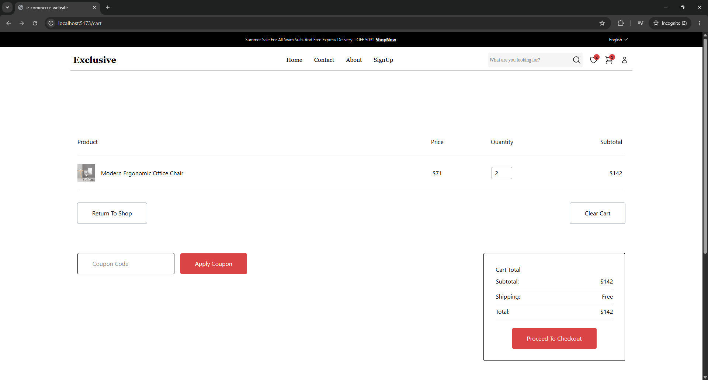
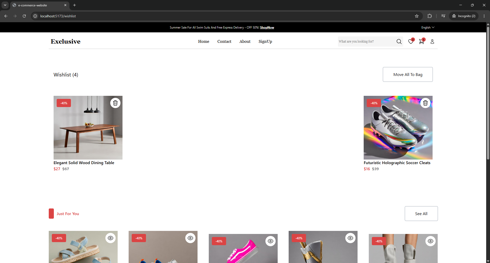

# E-Commerce Website

A modern React + Vite e-commerce storefront built with Tailwind CSS and Redux Toolkit. The app showcases product discovery, shopping cart management, wishlist tracking, product detail browsing, and a checkout flow with authentication screens.

## Project Overview

This is a single-page e-commerce application featuring:

- Responsive UI built with React and Tailwind CSS.
- Client-side routing using React Router.
- Global state management with Redux Toolkit.
- Data fetching via RTK Query from a public products API.
- Dedicated pages for home, product detail, cart, wishlist, checkout, account, about, contact, and auth.

## Key Features

- Home page with featured sections: flash sales, categories, best-selling products, new arrivals, and promotions.
- Product detail page with image gallery, size selection, add to cart, and wishlist actions.
- Cart page with quantity control, subtotal calculation, coupon field, and checkout navigation.
- Wishlist page that displays saved items and offers move-to-bag interactions.
- Checkout page with billing form, order summary, and payment method options.
- Authentication layout for login and signup flows.

## Tech Stack

- React 19
- Vite
- Tailwind CSS
- Redux Toolkit
- RTK Query
- React Router DOM
- Heroicons
- ESLint

## Architecture

- `src/main.jsx` initializes React and wraps the app with the Redux Provider.
- `src/App.jsx` defines the application routes and connects React Router.
- `src/app/store.js` configures Redux state, including product API middleware.
- `src/app/services/products/productsApi.js` uses RTK Query to fetch products from the EscuelaJS API.
- `src/app/features/cart/cartSlice.js` manages cart state, quantity adjustments, removals, and cart clearing.
- `src/app/features/wishlist/wishlistSlice.js` manages the wishlist state.

## Routes

- `/` — Home page
- `/contact` — Contact page
- `/about` — About page
- `/auth/login` — Login form
- `/auth/signup` — Sign up form
- `/wishlist` — Wishlist page
- `/cart` — Shopping cart page
- `/checkout` — Checkout page
- `/account` — My account page
- `/product/:id` — Product detail page

## Folder Structure

- `src/components/common` — shared UI components such as header, footer, buttons, product cards, and auth forms.
- `src/components/layout` — page sections and layouts used on home and product pages.
- `src/pages` — route-specific page components.
- `src/app/features` — Redux slices for cart and wishlist.
- `src/app/services/products` — API service layer for product data.

## Installation

```bash
npm install
```

## Development

```bash
npm run dev
```

Open the local Vite URL shown in the terminal to preview the app.

## Build

```bash
npm run build
```

## Notes

- Product data is loaded from `https://api.escuelajs.co/api/v1`.
- The authentication screens are present as UI forms, but they do not yet connect to a backend authentication service.

## Screenshots

### Home page


### Cart


### Wishlist


### Product details


### Checkout page


### Product catalog


### Categories and best selling


### Promotion items


### Footer


## Recommended Improvements

- Add real authentication and protected routes.
- Persist cart and wishlist state with local storage.
- Connect checkout forms to a real payment gateway.
- Add product search, filtering, and sorting capabilities.
- Improve form validation and UX in checkout/login/signup flows.


